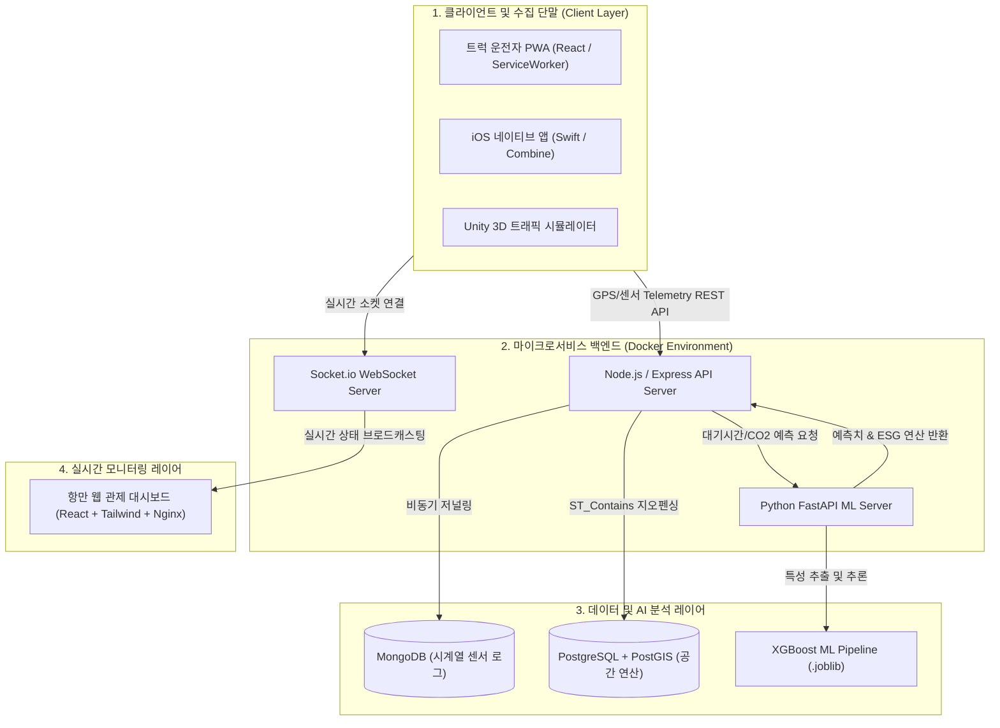

# 🚢 스마트 항만 물류 관제 & 디지털 트윈 AI 플랫폼 (Port Logistics Dashboard)

> 실시간 차량 텔레메트리 데이터 수집, PostGIS 지오펜싱 기반 입항 제어, AI 대기시간/ESG 탄소 배출 예측, 그리고 Unity 3D 디지털 트윈 시뮬레이션을 결합한 **엔드투엔드(End-to-End) 스마트 항만 물류 통합 관제 시스템**입니다.

## 1. 프로젝트 개요 (Overview)
**항만 터미널 진입 대기시간 증가로 인한 물류 정체 및 공회전 탄소 배출 문제**를 해결하기 위해 기획되었습니다. 실시간 텔레메트리 수집부터 AI 대기시간 예측, 공간 지오펜싱, 실시간 관제 및 3D 디지털 트윈을 마이크로서비스 아키텍처(MSA)로 통합하여, 물류 대기 정체를 완화하고 ESG 기반 실시간 탄소 배출량 모니터링 환경을 구축했습니다.

## 2. 시스템 아키텍처 (System Architecture)
다양한 클라이언트 환경과 분산된 마이크로서비스 백엔드를 연동하여 데이터 수집부터 분석, 모니터링까지 실시간으로 처리합니다.

## 3. 핵심 기술 파이프라인 (Core Pipelines)

* **📡 실시간 텔레메트리 수집 (Data Ingestion):** iOS/PWA 및 시뮬레이터로부터 차량 위치, 속도, RPM 데이터를 수집하고 맵 매칭(Map Matching) 알고리즘을 거쳐 MongoDB 시계열 컬렉션에 비동기 저널링 처리
* **🗺️ PostGIS 지오펜싱 (Spatial Pipeline):** PostgreSQL + PostGIS의 `ST_Contains` 공간 쿼리를 활용하여 항만 터미널 경계 내 차량 진입 여부를 자동 판별하고 입항 이벤트 트리거
* **🧠 AI 기반 대기시간 & ESG 연산 (ML Engine):** 7차원 피처 데이터를 파싱하여 XGBoost 기반 터미널 대기시간(원활/혼잡/심각) 예측 및 차량 공회전 시간에 비례하는 비선형 ESG 탄소 배출량 실시간 산출 (FastAPI 연동)
* **⚡ 실시간 관제 브로드캐스팅 (Real-time Event):** 터미널 혼잡도 급증 시 Socket.io를 통해 웹 대시보드 관제 UI 동기화 및 모바일 클라이언트에 우회 경로 푸시 알림 전송
* **🏗️ 디지털 트윈 & 강화학습 (Digital Twin & RL):** Unity 3D 기반 항만 물리 시뮬레이션 및 ML-Agents(PPO 강화학습)를 적용한 크레인-트럭 컨테이너 피킹 동선 최적화

## 4. 기술 스택 (Tech Stack)

| 구분 | 기술 스택 |
| :--- | :--- |
| **Backend API** | Node.js, Express, Socket.io, HTTP Server |
| **AI / ML** | Python, FastAPI, XGBoost, Scikit-learn, Pandas |
| **Database** | MongoDB (Telemetry), PostgreSQL + PostGIS (Spatial Data) |
| **Frontend / Mobile** | React 18, Tailwind CSS, PWA, Swift (iOS) |
| **Digital Twin** | Unity 3D, C#, Unity ML-Agents (PPO) |
| **DevOps / Infra** | Docker, Docker Compose, Nginx, GitHub Actions |

## 5. 기술적 성과 및 하이라이트 (Key Achievements)

* **MSA 기반 아키텍처 구축:** Node.js, FastAPI, DB 등 각 컴포넌트를 Docker Compose로 완전히 컨테이너화하여 서비스 간 결합도를 낮추고 배포 안정성을 확보했습니다.
* **복합 데이터 파이프라인 설계:** 단순한 CRUD를 넘어, 센서 데이터의 '비동기 적재(MongoDB)', '공간 연산(PostGIS)', 'AI 추론(FastAPI)'이 유기적으로 맞물려 돌아가는 엔드투엔드(End-to-End) 백엔드 파이프라인을 구현했습니다.
* **AI와 비즈니스 로직의 결합:** 모델 학습에 그치지 않고, XGBoost 예측 결과를 바탕으로 실시간 탄소 배출량 모니터링을 도출하고 모바일 기기에 우회 경로를 제안하는 실제 비즈니스 가치(ESG, 정체 해소) 중심의 서비스를 구축했습니다.
